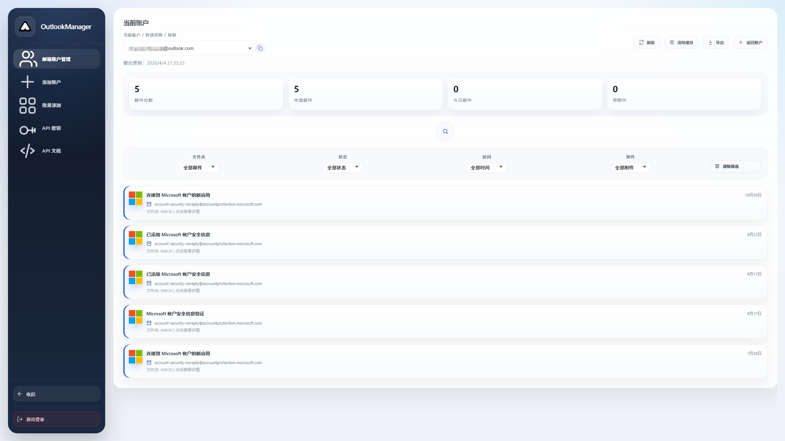
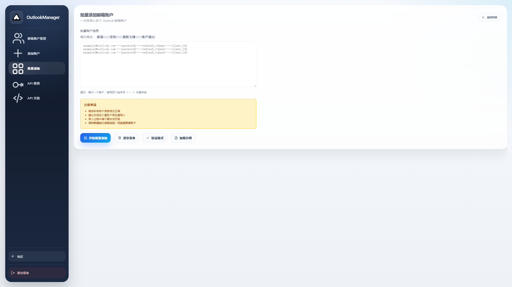
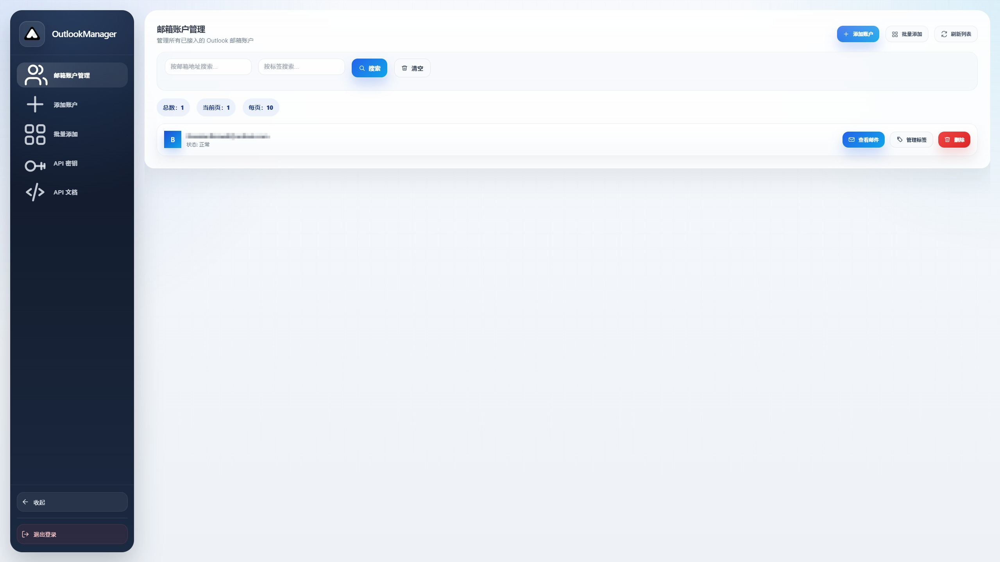
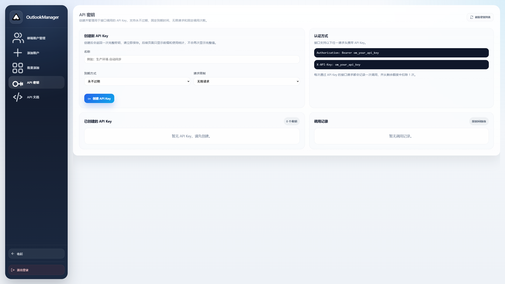
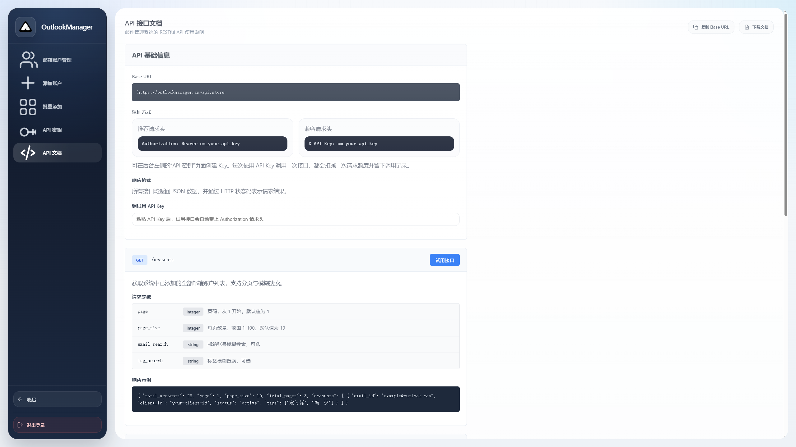

# OutlookManager

OutlookManager 是由 Maishan Inc. 维护的 Outlook 账户与邮件管理面板，提供 Web UI、批量导入、邮件检索、标签管理、API Key 管理和接口文档。

仓库地址：
<https://github.com/Maishan-Inc/OutlookManager>

线上部署优先推荐：
- `Railway`：最适合直接从 GitHub 仓库快速上线。
- `Zeabur`：适合可视化部署和国内用户使用。
- `Claw / Claw Cloud VPS`：适合需要完整服务器控制权、自定义反向代理和持久化策略的场景。

镜像地址：
- `maishanhub/outlookmanager:main`

## 核心特性

- Outlook 账户管理、批量导入、快速检索
- 收件箱 / 垃圾箱邮件查看与详情展示
- 邮件主题、发件人、内容搜索
- API Key 创建、停用、调用记录查看
- 内置 API 文档，适合二次开发与自动化接入
- 默认支持 Docker 部署，适合线上长期运行
- 首次访问支持初始化管理员密码与使用协议确认

## 界面预览

### 初始化


### 账户管理






### 邮件与 API







## 线上部署前必看

无论你使用 Railway、Zeabur 还是 Claw，部署时都建议保持以下约束：

- 持久化目录挂载到 `/app/data`
- 服务对内端口使用 `8000`
- 首次上线后访问 Web 页面完成初始化
- 如果暴露到公网，请自行配置 HTTPS、访问控制、日志审计和备份
- 若需要长期稳定运行，优先绑定自定义域名

推荐环境变量：

| 变量名 | 推荐值 | 说明 |
| --- | --- | --- |
| `HOST` | `0.0.0.0` | 容器内监听地址 |
| `PORT` | `8000` | 容器内监听端口 |
| `DATA_DIR` | `/app/data` | 数据目录 |
| `ACCOUNTS_FILE` | `/app/data/accounts.json` | 账户数据文件 |
| `PYTHONUNBUFFERED` | `1` | 便于查看日志 |

健康检查地址：

- `GET /api/auth/state`

## Railway 在线部署

Railway 适合直接从 GitHub 仓库上线，也适合直接使用 Docker 镜像。

### 方式一：从 GitHub 仓库部署

1. 登录 Railway。
2. 创建新项目并选择 `Deploy from GitHub repo`。
3. 选择仓库 `Maishan-Inc/OutlookManager`。
4. Railway 会检测到仓库内的 `Dockerfile` 并构建部署。
5. 为服务添加持久化卷，并挂载到 `/app/data`。
6. 补充环境变量：
   `HOST=0.0.0.0`
   `PORT=8000`
   `DATA_DIR=/app/data`
   `ACCOUNTS_FILE=/app/data/accounts.json`
7. 部署完成后打开 Railway 分配的域名。
8. 首次进入页面，先完成管理员密码初始化。

### 方式二：直接使用镜像部署

1. 在 Railway 新建服务。
2. 选择使用 Docker Image。
3. 填入镜像：
   `maishanhub/outlookmanager:main`
4. 挂载持久化卷到 `/app/data`。
5. 设置与上面一致的环境变量。
6. 发布后访问域名完成初始化。

### Railway 部署备注

- 建议启用自定义域名和 HTTPS。
- 如果你只想最少操作上线，Railway 是最省事的选择。
- 只要卷路径正确，服务重启后数据会保留。

官方文档参考：
- <https://docs.railway.com/guides/github>
- <https://docs.railway.com/guides/dockerfiles>
- <https://docs.railway.com/guides/volumes>

## Zeabur 在线部署

Zeabur 比较适合可视化管理，也很适合从 GitHub 仓库直接部署。

### 方式一：导入 GitHub 仓库

1. 登录 Zeabur。
2. 新建 Project。
3. 选择从 GitHub 导入仓库：
   `https://github.com/Maishan-Inc/OutlookManager`
4. Zeabur 检测到 `Dockerfile` 后会按容器方式构建。
5. 在服务配置中添加持久化存储，挂载目录设为 `/app/data`。
6. 添加环境变量：
   `HOST=0.0.0.0`
   `PORT=8000`
   `DATA_DIR=/app/data`
   `ACCOUNTS_FILE=/app/data/accounts.json`
7. 等待部署完成后，使用分配域名访问。

### 方式二：使用 Docker 镜像

1. 在 Zeabur 创建新服务。
2. 选择容器 / Docker Image 方式。
3. 填入镜像：
   `maishanhub/outlookmanager:main`
4. 添加卷并挂载到 `/app/data`。
5. 配置环境变量并发布。

### Zeabur 部署备注

- Zeabur 界面化程度更高，适合不想手动写部署脚本的场景。
- 如果你要绑定域名，部署完成后直接在项目里添加域名即可。
- 生产环境仍然建议保留持久化卷和 HTTPS。

官方文档参考：
- <https://zeabur.com/docs/deploy-from-git>
- <https://zeabur.com/docs/deploy-from-dockerfile>
- <https://zeabur.com/docs/service/storage>

## Claw 在线部署

这里推荐使用 `Claw Cloud VPS` 方案。它更接近传统服务器，自由度最高，但需要你自己负责 Docker、域名和反向代理。

如果你想要一键式平台，优先选 Railway 或 Zeabur。

### 方式一：用仓库内 `docker-compose.yml`

1. 在 Claw Cloud 创建一台 Linux VPS。
2. 安装 Docker 与 Docker Compose。
3. 克隆仓库：

```bash
git clone https://github.com/Maishan-Inc/OutlookManager.git
cd OutlookManager
```

4. 启动服务：

```bash
docker compose up -d
```

5. 默认会使用镜像 `maishanhub/outlookmanager:main`。
6. 确认宿主机 `./data` 已映射到容器 `/app/data`。
7. 通过 VPS 公网 IP 或你自己的域名访问服务。

### 方式二：手动创建容器

```bash
docker run -d \
  --name outlook-manager \
  -p 8000:8000 \
  -e HOST=0.0.0.0 \
  -e PORT=8000 \
  -e DATA_DIR=/app/data \
  -e ACCOUNTS_FILE=/app/data/accounts.json \
  -v /opt/outlookmanager/data:/app/data \
  --restart unless-stopped \
  maishanhub/outlookmanager:main
```

### Claw 部署备注

- 建议配合 Nginx 或 Caddy 做域名反代和 HTTPS。
- 建议放行 `80` / `443`，不要长期裸露高位端口。
- 如果是团队长期使用，Claw VPS 更适合做稳定自托管。

官方文档参考：
- <https://docs.claw.cloud/getting-started/quick-start>
- <https://docs.claw.cloud/serverless-apps/how-to-guides/deploy>

说明：
- 上面的 Claw 部署方法是基于 Claw Cloud VPS / 服务器方式整理的做法，不是声称该平台当前一定提供与 Railway/Zeabur 完全相同的一键 PaaS 工作流。

## 本地 / 自托管 Docker 部署

如果你不走云平台，也可以直接在自己的服务器或本地机器使用 Docker Compose。

```bash
git clone https://github.com/Maishan-Inc/OutlookManager.git
cd OutlookManager
docker compose up -d
```

默认配置见：
- [docker-compose.yml](./docker-compose.yml)
- [Dockerfile](./Dockerfile)
- [docker.env.example](./docker.env.example)

## 首次使用流程

1. 打开首页。
2. 阅读并同意使用协议。
3. 设置管理员密码。
4. 登录后台。
5. 添加单个 Outlook 账户，或使用批量导入。
6. 进入邮件页面查看收件箱 / 垃圾箱邮件。
7. 如需程序化调用，可进入 API 密钥页面创建 Key。

## 目录结构

```text
OutlookManager/
├─ main.py
├─ static/
│  ├─ index.html
│  └─ favicon.ico
├─ docs/
│  └─ images/
├─ data/
├─ Dockerfile
├─ docker-compose.yml
├─ docker-entrypoint.sh
├─ docker.env.example
├─ requirements.txt
└─ README.md
```

## 开发与调试

### 本地运行

```bash
pip install -r requirements.txt
python main.py
```

默认访问地址：
- Web：<http://127.0.0.1:8000/>
- API 文档：<http://127.0.0.1:8000/docs>

### 关键接口

- `GET /api/auth/state`
- `POST /api/auth/setup`
- `POST /api/auth/login`
- `POST /api/auth/logout`
- `GET /accounts`
- `POST /accounts`
- `GET /emails/{email_id}`
- `GET /emails/{email_id}/{message_id}`
- `GET /api/api-keys`
- `POST /api/api-keys`

## 开源说明

本项目为 Maishan Inc. 开源程序，适合学习、研究、测试与自部署使用。

如果你计划将其用于商业化项目、对外收费服务或深度定制交付，建议先与 Maishan Inc. 沟通商业化方案。

官网：
<https://www.maishanzero.com>
